## IAM & AWS CLI

IAM = Identity And Access Management, Global Service.

Dentro de uma conta AWS eu posso ter várias pessoas (users).
Eu posso separar esses users por grupos.

Grupos só podem conter uauários e não outros grupos.

Um usuário pode não pertencer a nenhum grupo.

Um usuário pode pertencer a vários grupos.

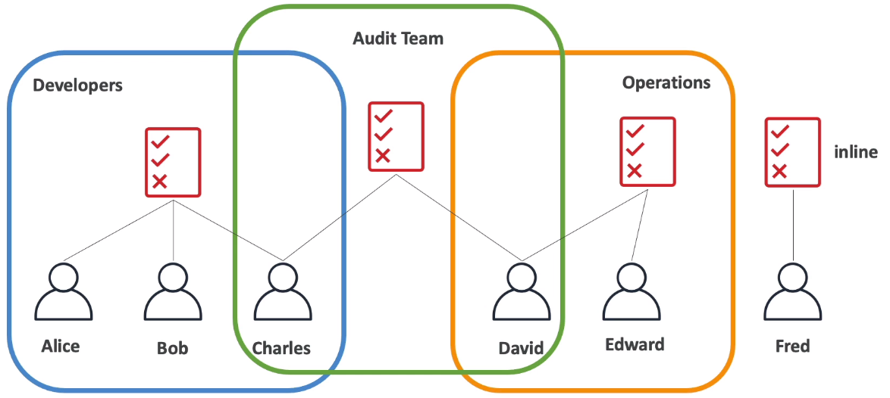

**POLICIES**: basicamente é o documento que descreve as permissões que cada uduário ou grupo pode conter. Policie do grupo é passada de herança para os membros do grupo.

Para usuário que não tem grupo posso criar policie inline.

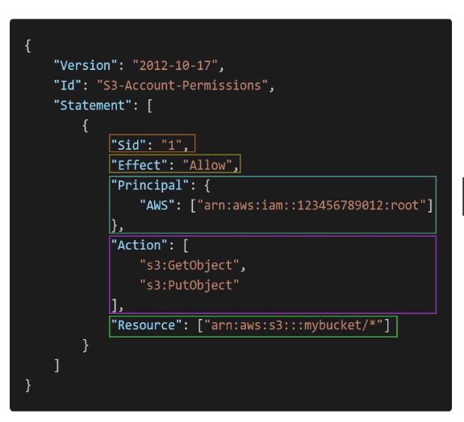

**Version:** Versão da linguagem da politica.  
**ID**: Opcional  
**SID:** Opcional  
**Effect:** Diz se permite ou se nega  
**Principal:** Conta / Usuário / Grupo que a politica será aplicada  
**Action:** Lista de ação que a politica permite  
**Resource:** Lista de recursos ao qual as politicas serão aplicadas

## IAM Security Tools

- IAM credentials report
- IAM access advisor

Modelo de responsabilidade compartilhada.

**Aqui a AWS cuida**  
INFRA  
Configs e Analise de vulnerabilidades  
Compliance Validaition

**Aqui o usuário cuida**  
Users, grupos, policies...

## EC2 Fundamentals
AWS Budgets vai gerar alertas para quando ultrapassarmos o limite definido de custos.

### EC2 Elastic Compute Cloud - Infra as a Service

**Capacidades:**   
Máquinas virtuais (EC2)   
Armazenar dados em unidades virtuais ou volumes (EBS)   Distribuir carga entre máquinas (ELB)   
Escalar serviços usando um grupo de escalonamento automático (ASG)

### EC2 User Data
Ao criar uma instância você pode configurar um script para que nessa primeira inicialização ele carregue determinadas configurações. Esse script roda com um usuário root.

### Instance Types

M5.2xlarge

M = Classe da instância  
5 = Geração (AWS melhora conforme o tempo)  
2xlarge = Tamanho da instância

**Uso geral:** Boa para tarefas intensivas que requerem alta perfomance do processador.

**Memory Optimized:** Boa para grandes cargas de dados na memória.

**Storage Optimized:** Boa para grandes cargas de trabalho que exigem leitura e gravação sequencialde alto conjunto de dados.

### Security Groups
Controla como o trafego é permitido dentro e fora das instâncias. Security group contém apenas permissões.

Ele pode referenciar por IP ou por outro Security group. 

Security group age como um firewall.

Regulam:
- Acesso a portas
- Autorizam ranges de IP's
- Controlam o tráfego de entrada e saída da instância
- Podem ser vinculados a multiplas instâncias
- São uma confirmação por região. Se mudar de região precisa muda-lo.
- "Vive" fora da instância
- É bom criar um grupo separado para SSH
- Por padrão todo tráfego de entrada é bloqueado
- Todo tráfego de saída é autorizado por padrão

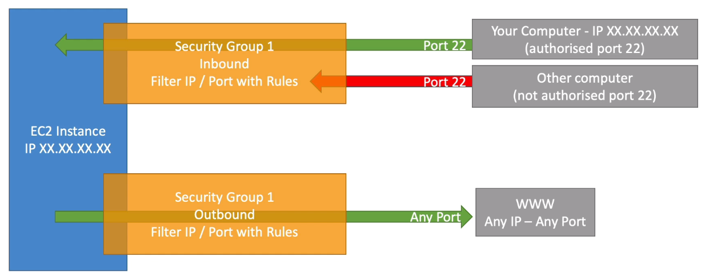

#### Portas para saber
**22** = SSH (Secutiry Shell) Permite que você faça login em uma instância EC2 no linux  
**21** = FTP (File Transfer Protocol) Usada para fazer upload de arquivos em um compartilhamento de arquivos  
**22** = SFTP (Secure file transfer portocol) Fazer upload de arquivos no modo seguro  
**80** = HTTP Acesso de sites não seguros  
**443** = HTTPS Acesso de sites seguros  
**3389** = RDP (Remote desktop protocol) Fazer login em uma instância Windows

*Para configurar SSH na instância eu posso usar EC2 Instance Connect*

### EC2 Instances Purchasing Options

**On-Demand**: Workload curto, preço previsivel, pago por segundo usado  
**Reserved**: (1 a 3 anos) Workloads longos. Convertible reserved instances: longos workloads com flexibilidade de instâncias  
**Saving Plans:** (1 a 3 anos) Comprometimento com a quantidade de uso, longos workloads.  
**Spot Instance:** Workloads curtos, são muito baratas, mas podemos perder a instância a qualquer momentos (menos confiavel)  
**Dedicated Hosts:** Permite que reserve um servidor fisico inteiro e controle o posicionamento das instâncias  
**Dedicated Instances:** Nenhum outro cliente vai usar o seu hardware  
**Capacity Reservations:** Permite reservar uma capacidade em um AZ especifico por qualquer duração

## EC2 On Demand
Pago pelo o que usar.

Linux ou Windows: Pago por segundo, após o primeiro minuto.

Todos os outros sistemas operacionais pagos por hora.

Tem um custo mais alto mas não tem pagamentos antecipados e sem compromisso de longo prazo.

Recomendado para um curto workload e sem interrupção, onde você não pode prever como o sistema vai se comportar.

## EC2 Reserved Instances
Um desconto de 72% compardo com On-Demand.

Você reserva atributos especificos (tipo da instância, região, OS)...

Reserva o periodo: 1 ano (+descontos) ou 3 anos (++descontos).

Opções de pagamento: Sem adiantamento (+), adiantamento parcial (++), total adiantamento (+++).

Instâncias reservadas por escopo: Região ou zona.

Recomendado para aplicações com uso de estado (por exemplo banco de dados).

Você pode comprar ou vender instâncias reservadas no marketplace se não precisar mais delas.

## Instâncias reservadas conversiveis
Pode mudar o tipo da instância, a familia da instância, OS...

Pode ganhar até 60% de desconto.

## EC2 Saving Plans

Desconto com base no termo de longo prazo.

Você diz que quer pagar por exemplo "10"reais por hora por 1 ou por 3 anos.

Qualquer custo a mais será cobrado no modo On-Demand.

Você fica preso ao tipo especifico da familia e região (ex: M5 em US-East-1)

Flexivel entre: Tamanho das instâncias (M5 large, M5 2x.large). OS (Linux, Windows). Locação (Host, dedicated, default)

## EC2 Spot Instances
Desconto de até 90% comparado com On-Demand.

São as instâncias mais economicas da AWS.

Você pode perder a qualquer momento se o seu preço máximo for menor que o preço atual da instância.

Boa para workloads resistentes a falha.

Batch, Analise de dados, Processamento de imagem, Qualquer tipo de carga de trabalho distribuida, Workloads que tenham horário de inicios e fim flexiveis.

Não recomendado para trabalhos criticos e banco de dados.

## EC2 Dedicated Hosts
Um servidor fisico com uma instância EC2 totalmente dedicada para seu uso.

Opções de pagamento:  
On-Demand: Paga por segundo ativo  
Reserved: 1 ou 3 anos (sem pagamento adiantado, pagamento parcial, todo pagamento).

A opção mais cara da AWS porque você reserva o servidor fisico.

Um exemplo de uso é quando você tem um software com uma herança de uso.

Ou se você tem uma empresa com fortes regulações.

## EC2 Dedicated instances
Roda em um Hardware que é dedicado para você.

Você pode compartilhar o Hardware com outras instâncias na mesma conta

Não tem controle sobre o posicionamento das instâncias.

Instâncias dedicadas você pode ter sua própria instância em seu próprio Hardware enquanto Host Dedicado você obtém acesso ao proprio servidor fisico.

## EC2 Capacity Reservations
Pode reservar instâncias On-Demand com capacidade em um AZ especifico em um AZ especifico por qualquer duração.

Você sempre tem acesso a capacidade do EC2 quando precisar.

Não tem compromisso de tempo, pode reservar ou cancelar a qualquer tempo, sem desconto no faturamento.

Se quiser descontos precisa combinar instâncias reservadas e Saving Plans para obter descontos.

Você cobrado sobre as taxas sob demanda, independente de executar ou não as instâncias.

Recomendado para termo de curto prazo, workload sem interrupção que precisa estar em um AZ especifico.

## EBS
Elastic Block Store: É uma unidade de rede que você pode anexar as suas instâncias enquanto são executadas.

Permite persistir os dados da instância mesmo que ela for terminada.

Multiplas instâncias para multiplos EBS.

É vinculado a uma zona de disponibilidade especifica.

Analogia: Da pra pensar como um USB porém não de forma fisica.

Free-Tier: 30GB grátis do tipo General Purpose (SSD) ou magnetic por mês.

Como é conectado a rede pode ser que tenha latência.

Pode ser atachado e desatachado rapidamente

São bloqueados por Zona de disponibilidade 

A capacidade (GBs) precisa ser provisionada antes.

Será cobrado por essa capacidade provisionada.

Pode aumentar a capacidade ao longo do tempo.

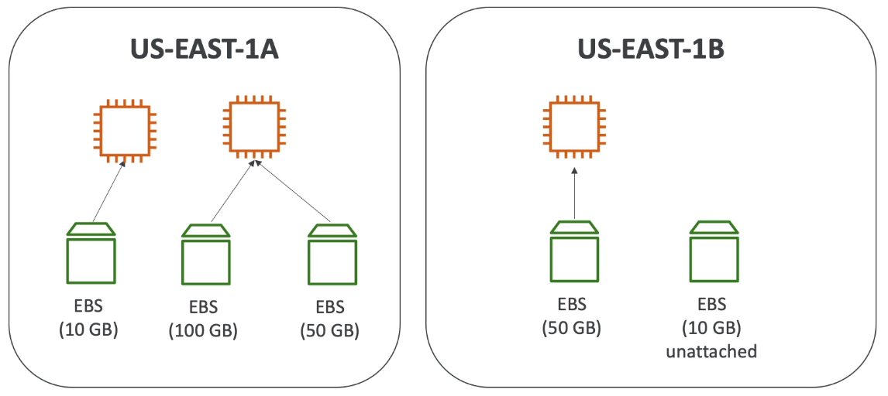

### EBS - Delete on Termination Attribute

Controla o comportamento do EBS quando a instância é terminada.

Por padrão o EBS ROOT volume é deletado, essa opção já vem ativa.

Volume atachados por padrão não são deletados.

### EBS Snapshot

É um backup do seu EBS

Não é necessário desatachar o volume do EC2, mas é recomendado.

Eu posso ter um snapshot de uma região e posso utiliza-lo em outra.

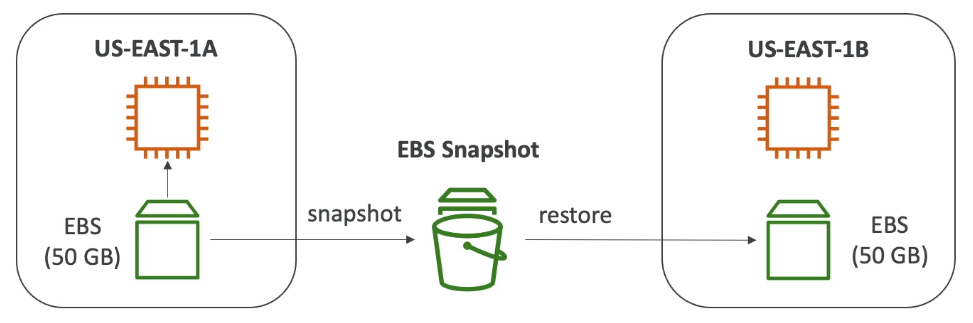

Basicamente é assim que se transfere um volume EBS de uma zona para outra.

### EBS Snapshot Features
EBS Snapshot archive: Essa é uma camada que é 75% mais barata.

Leva de 24 a 72 horas para restaurar o arquivo, não é imediato.

**Recycle Bin For EBS SnapShots**
É a configuração de regras que leva os arquivos deletados para uma lixeira, evitando acidentes caso você apague sem querer ele vai para esse recycle bin.

A retenção pode ser entre 1 dia e 1 ano.

**Fast snapshot restore (FSR)**
Força a completa inicialização do snapshot pra que não tenha nenhuma latância no primeiro uso.

Custo bem caro.

## AMI Amazon Machine Image
Basicamente é a personalização de uma instância EC2.

Você adiciona seu próprio software, configuração, sistema operacional, software de monitoração...

O boot fica mais rápido porque todo seu software já está pré-empacotado.

AMI é construido para uma região especifica (mas pode ser copiado entre as regiões).

Posso subir uma instância com: AMI publicas que a AWS provê.

Minha própria AMI

Uma AMI comprada no marketplace.

## EC2 Instance Store
É como se fosse um "USB" fisico mesmo que você aloca lá no servidor.

Tem uma performance maior

É efemeral, se a instância for terminada você perde esse store.

É como se fosse uma memória RAM.

Backup e replicação totalmente nossa responsabilidade.

## EBS Volume Types

#### EBS Volumes tem 6 tipos

- **gp2 / gp3 (SSD)**: É para um propósito geral, um volume SSD que tem um balanço de performance e preço e abrange uma grande variedade de cargas de trabalho.
- **io1 / io2 (SSD)**: É utilizado para cargas de trabalho que exigem grande performance e de grande criticidade com baixa latência ou um throughput alto.
- **st1 (HDD)**: Um HDD de baixo custo, feito para cargas de trabalho que exigem acesso frequente.
- **sc1 (HDD)**: O HDD mais barato, feito para cargas de trabalho que não exigem um acesso tão frequente.

#### EBS Volumes são caracterizados por Tamanho | Throughput | IOPS (I/O Ops Per Sec - Entrada e Saída por segundo)

#### Apenas gp2/gp3 e io1/io2 podem ser usados para volumes de boot

## EBS Volumes Types Use cases

### General Purpose SSD
- É um armazenamento econômico, com baixa latência
- Pode ser usado para boot volumes, Virtual desktops, ambientes de desenvolvimento e de testes
- O tamanho pode variar entre 1GB e 15 TB

**gp2**
- É uma geração mais antiga
- Tem pequenos volumes que podem romper IOPS até 3 mil
- O tamanho do volume e IOPS **são ligados**, maximo IOPS é 16 mil

**gp3**
- É a geração mais nova
- Da uma base de 3 mil IOPS e um throughput de 125 megabytes por segundo
- Podemos aumentar o IOPS até 16 mil e o throughput até 1000 MB/s **independentemente**
  
### Provisioned IOPS (PIOPS) SSD
- É um bom caso para quando se tem uma aplicação comercial crítica que necessita de sustentação de performance de IOPS
- Ou aplicações que necessitem de mais de 16 mil IOPS
- Bom uso para Banco de Dados que são sensiveis para o armazenamento, performance e consistência

**io1 / io2 (4GB - 16TB)**
- Maximo PIOPS: 64 mil para instancias Nitro e 32 mil para outras
- Pode aumentar PIOPS **independentemente** do tamanho da instância
- io2 tem mais durabilidade e mais IOPS por GB (e o mesmo preço da io1)

**io2 Block Express (4GB - 64TB)**
- Uma latência de menos de milisegundos
- Maximo de PIOPS 256 mil com um IOPS GB ratio de 1 mil
- Suporta EBS Multi-attach

### Hard Disk Drives (HDD)
- Não servem para ser volumes de boot
- Tamanhos de 125 GB até 16 TB

**Throughput Optimized HDD (st1)**
- Bons para Big Data, Data Warehouses, Log Processing
- Maximo de throughout 500 MB, maximo IOPS 500

**Cold HDD (scl)**
- Bom para dados que não são acessados frequentemente
- Cenários onde o baixo custo é mais importante
- Maximo throughput 250 MB, maximo IOPS 250

## EBS Multi-Attach - io1 / io2 family

- Com esta familia podemos atachar o mesmo volume EBS a multiplas instancias EC2 no mesmo AZ.
- Cada instância tem full permissão de leitura e escrita para uma performance maior do volume.

**Caso de uso:** 

Uma aplicação que com maior disponibilidade no caso de um cluster Linux, exemplo: Teradata

Ou um caso que deve gerenciar multiplas operações de escrita em paralelo

- Um volume só pode ser atachado até no máximo 16 instâncias ao mesmo tempo

## Amazon EFS - Elastic File System

É um gerenciador de sistema de arquivos de rede (network file system) e que pode ser monstado em várias instâncias EC2

- Essas instâncias podem estar em diferentes AZs
- Tem alta disponibilidade, escalabilidade, tem um alto custo (3x gp2), e o pagamento é por uso

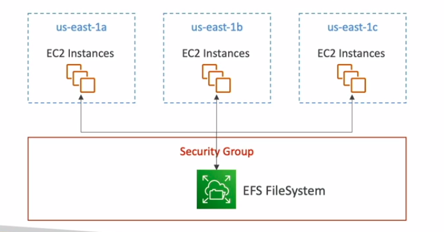

- **Casos de uso:** Gerenciamento de conteúdo, web serving, compartilhamento de dados, Wordpress
- Usa o protocolo NFSv4
- Usa o security group para o controle de acesso ao EFS
- Compativel com Linux based AMI (não compativel com Windows)
- Criptografa os dados em repouso usando KMS
- Utiliza o sistema de arquivos POSIX (~Linux) que possui um arquivo API padrão
- Não é preciso planejar com antecedência a capacidade, ele escala automaticamente
- Pago por uso de GB, não por capacidade

### Storage Classes

#### Storage Tiers (gerenciamento do ciclo de vida, move um arquivo depois de N dias)
- Padrão: para arquivos acessados recentemente
- Infrequent access (EFS-IA): Recuperar arquivos infrequentes, o preço é menos para esse armazenamento e para habilitar esse armazenamento você deve usar uma política de ciclo de vida

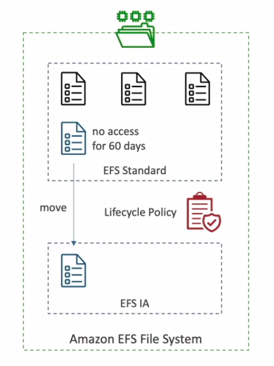

#### Disponibilidade e durabilidade
- Padrão: Multi-AZ, bom para cenários de produção
- One Zone: Uma zona de disponibilidade, bom para ambiente de dev, backup habilitado por padrão, compativel com IA (EFS One Zone-IA)

Pode ter descontos de até 90%

## EBS vs EFS

### EBS
- Só podem ser anexados a uma instância de cada vez, exceto o multi-attach da familia **io1 / io2**
- São travados por Zona de disponibilidade, só pode atachar um volume em uma instância da no mesmo AZ
- gp2 IO aumenta se o tamanho do disco aumentar
- io1 pode aumentar o IO **independentemente**
- Para migrar um volume entre zonas diferentes é preciso tirar uma snapshot e restaura-lo na outra zona de destino
- EBS backups usa o IO e não deve ser excutado enquanto sua aplicação estiver lidando com bastante trafego por que isso pode afetar o desempenho
- Em volumes Root a opção para terminated quando a instancia for 'terminated' vem habilitada por padrão, mas podemos desabilitar esta opção

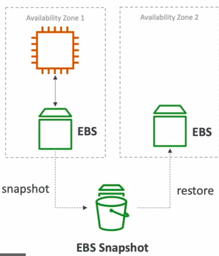

### EFS
- O objetivo é trabalhar entre diferentes AZs
- Podemos compartilhar por exemplo arquivos de um website WordPress
- É apenas para instancias Linux por causa do sistema (POSIX)
- Tem um custo maior que o EBS, mas podemos economizar usando o EFS-IA (Elastic File System Infrequent Access)

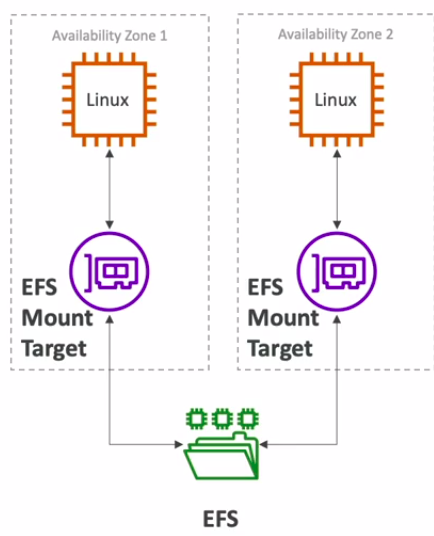

Relembrando **Instance Store** é a armazenagem fisica instantanea, ou seja se a instância parar você perde esse armazenamento.

## ELB + ASG

#### Scalability & High Availability
Escalabilidade significa que a aplicação pode e deve se adpatar a maiores cargas de trabalho.   
Existe dois tipo de escalabilidade: Vertical e Horizontal.  
Escalabilidade e Disponibilidade estão ligadas mas não são a mesma coisa.

#### Escalabilidade Vertical
- Significa você aumentar o tamanho da sua instância basicamente
- Escalabilidade vertical é muito comum em sistemas não distribuidos, como por exemplo, banco de dados, RDS, ElasticCache...
- Essa escalabilidade pode ter limite, esse limite é o hardware.

#### Escalabilidade Horizontal
- Significa escalar com mais instancias
- Esse tipo é usado em sistema distribuidos, bem comum em aplicações modernas, web app por exemplo
- É facil de escalar horizontalmente, basicamente é só subir mais instâncias ec2

#### Alta Disponibilidade
É você deixar seu sistema funcionando mesmo com a perda de algum data center. É você ter redundância. Você rodar em mais de uma zona de disponibilidade ou região.
  
Existe a disponibilidade passiva e ativa, passiva é quando o serviço que estamos usando já é multi AZ por exemplo. Ativa é quando temos na nossa arquitetura a distribuição em mais de uma zona de disponibilidade.

## Elastic Load Balancing (ELB)
Serve para coordenar o tráfego de requisições e distribuir entre os multiplos servidores.
 

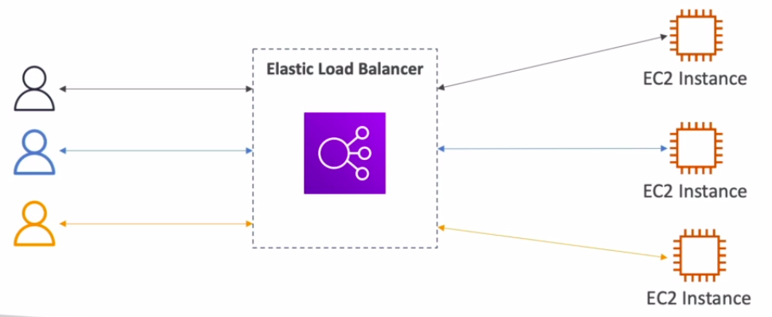

Temos três instâncias EC2, um balanceador de carga e três usuários fazendo requisição. O balanceador vai interceptar essas requisições e distribuir da melhor forma para cada servidor, não deixando que nenhum deles fique sobrecarregado.

**Por que utilizar um balanceador de carga?**
- Ele distribui a carga entre as multiplas instancias
- É exposto apenas um ponto de acesso (DNS) a aplicação
- Ajuda a lidar com falhas e quedas de instâncias, uma vez que ele só vai mandar carga para instâncias que estiverem de pé
- Ele vai regularmente fazer health checks nas instancias
- Provê terminação SSL (HTTPS) para os websites
- Alta disponibilidade entre zonas
- Separa trafego publico de trafego privado

### Tipos de Load Balancer
A AWS tem 3 tipos de balanceador de carga

- **Application Load Balancer** (v2 - nova geração) - 2016 ALB, HTTP, HTTPS, WebSocket
- **Network Load Balancer** (v2 - nova geração) - 2017 NLB, TCP, TSL, UDP
- **Gateway Load Balancer** - 2020 GWLB, Opera nas três camadas (Camadas de rede), IP Protocol

É recomendado sempre usar o balanceadores da mais nova geração.

#### Load Balancer Security Groups
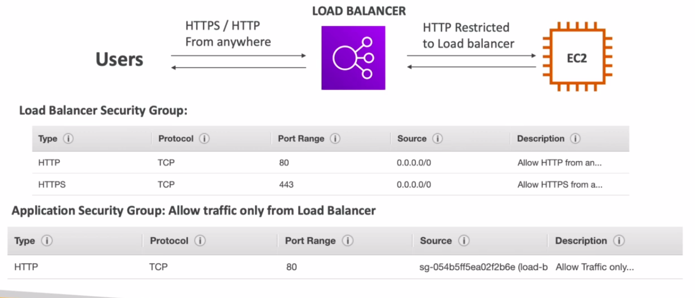

O grupo de segurança do load balancer vai dar acesso vindo de qualquer ip de origem, por afinal os usuário vão estar acessando e batendo nesse elb. Aceitando aqui no caso as portas HTTP e HTTPS.

 

Já o grupo de segurança da instância nesse caso, vai usar o protocolo HTTP na porta 80, permitindo trafego de origem apenas do grupo de segurança do ELB e não mais de um range de ip. Porque aqui só queremos aceitar requisições vindas do ELB e não diretamente do usuário.

---

### Entrando mais um pouco a fundo em cada tipo de Load Balancer

#### Application Load Balancer (v2)
- Trabalha na camada 7 (HTTP)
- Faz o balanceamento entre multiplas aplicações entre maquinas (target groups)
- Faz o balanceamento entre multiplas aplicações na mesma maquina (ex: containers)
- Tem suporte para HTTP/2 e WebSocket
- Também suporta redirects de HTTP para HTTPS por exemplo
- Consegue fazer o roteamento de rotas em diferentes target groups
    Conseguimos por exemplo, mudar o path da rota URL, o hostname da rota do site, os query strings ou headers também
- Esse tipo é ótimo para micro serviçoes e aplicações baseadas em container, ex: Docker e Amazon ECS
- ALB pode rotear para multiplos target groups

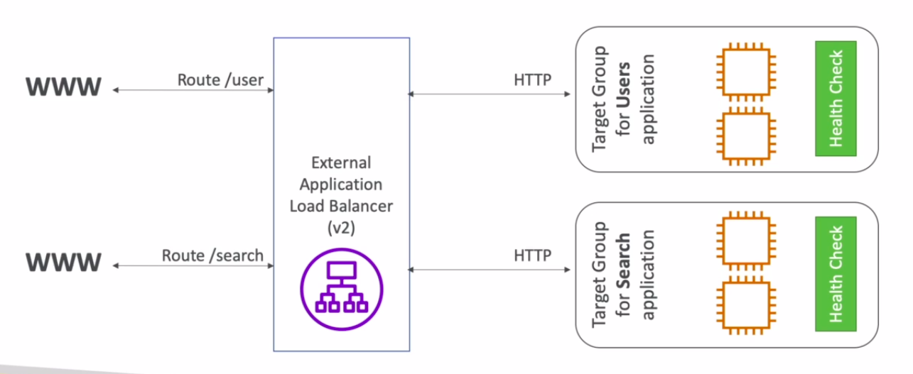

Aqui um exemplo de como o Application Load Balancer funciona. Podemos ter dois microsserviços diferentes e com rotas também diferentes dentro de target group, no meio o ALB e ele vai conseguir saber diferenciar as requisições com as diferentes rotas para seu respectivo microserviço.

### O que é um target group?

- Podem ser instâncias EC2 (gerenciadas por um Auto Scaling Group) - HTTP
- Podem ser tasks ECS (gerenciadas por ECS mesmo) - HTTP
- Podem ser lambdas functions, a requisição HTTP vai ser traduzida em um evento JSON
- Podem ser um endereço de IP, mas devem ser IPs privados

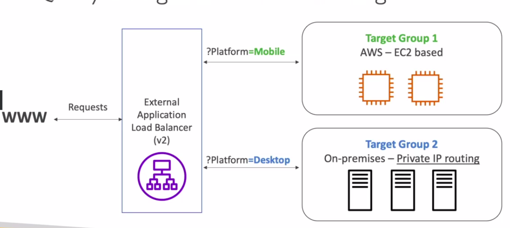

Atráves de query strings o ALB também consegue fazer redirecionamentos.

- APL também consegue trabalhar com hostnames fixos, (xxx.region.elb.amazonaws.com)
- A aplicação não vê qual foi o IP do client diretamente, ele consegue ver o ip nos headers da requisição, X-Fowarded-For
- Da mesma forma a porta, X-Forwarded-Port e protocolo X-Forwarded-Proto

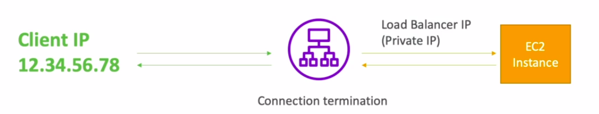

---
### Network Load Balancer (v2)

É um balanceador de carga na camada de rede, (layer 4). Permite que:

- Trafego TCP e UDP para suas instancias
-  É muito eficiente e pode lidar com milhões de requisições por segundo
-  A latência é reduzida em comparação com ALB ~100 ms (vs 400 ms para ALB)
-  NLB tem apenas um IP estático por AZ, e você pode atribuir um IP elástico para cada AZ. (Isso é bom quando você precisa expor sua aplicação com um conjunto de IPs estáticos e estes podem ser IPs elásticos).
-  NLB é usado para quando precisamos de performance extrema, TCP ou UDP.
- **Sua utilização não está incluida no modo free tier da AWS**

 
Como funciona o Network Load Balancer:

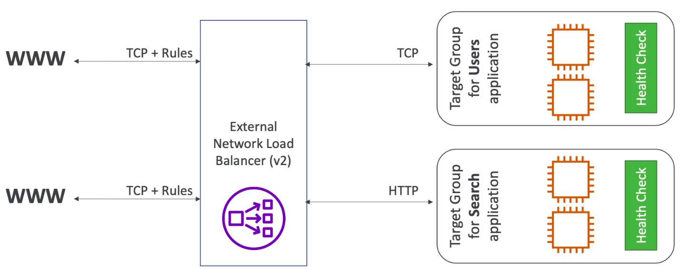

#### Network Load Balancer - Target Groups
- Instâncias EC2

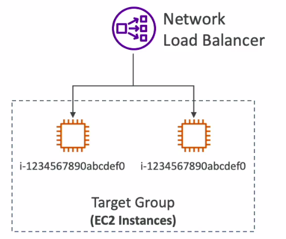

- Endereço IP. Devem ser IPs privados

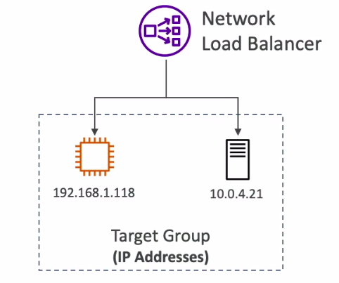

- Application Load Balancer

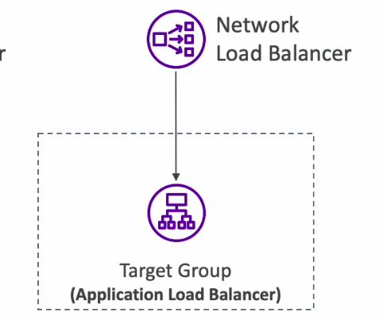

*Ponto importante para o exame*, Health Checks suportam os protocolos TCP, HTTP e HTTPS.

---
### Gateway Load Balancer

É usado para implantar, dimensionar e gerenciar uma frota de dispositivos neutros de rede de terceiros na AWS.

**Exemplo de uso:** Você usuaria um GLB se quisesse que todo o tráfego de sua rede passasse por um firewall que você possui ou por um sistema de detecção e prevenção de instrusão para IDPs ou um sistema de inspeção profunda de pacotes ou se deseja modificar algumas cargas úteis.

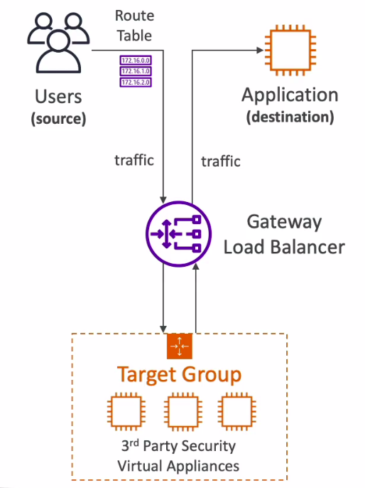

- GLB opera na camada de pacotes, layer 3 (Network)

*Para o exame o GLB usa o GENEVE protocolo na porta 6081*

#### Gateway Load Balancer - Target Groups

- Instâncias EC2

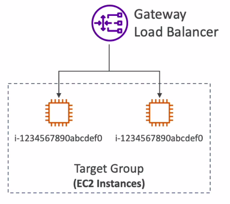

- Endereços de IP. Devem ser IPs privados

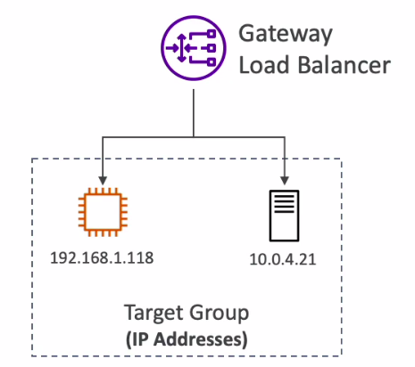

 

## Cross-Zone Load Balancing

Balanceamento cruzado, significa que entre diferentes zonas de disponibilidade o balanceador vai distribuir a carga igualmente entre cada instância nas diferentes AZs. Isso pode ser um comportamento que você queira ou não.

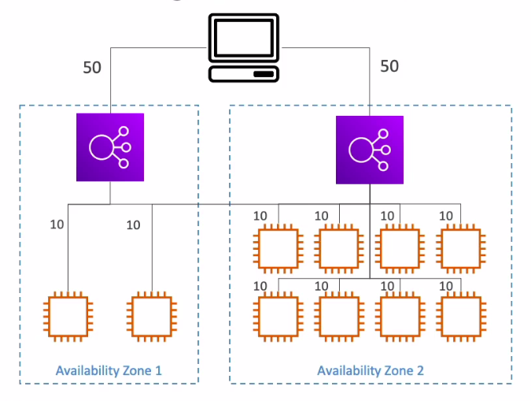

 

Agora sem essa função de cross zone: 
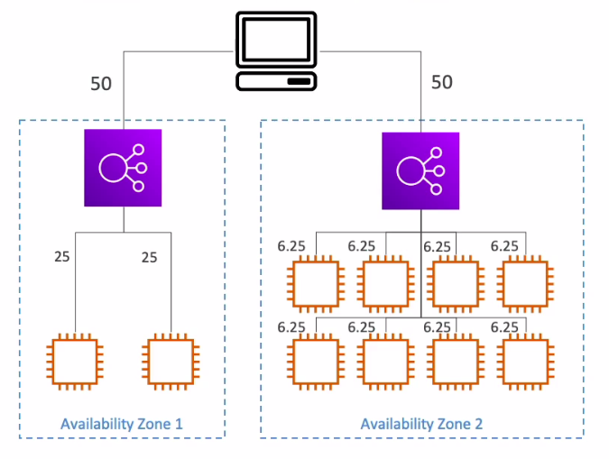

As cargas são distribuidas apenas entre a zona que a carga chega.

#### Application Load Balancer
- Vem habilitado por padrão o cross-zone, mas pode ser desabilitado no nível do Target Group
- Não há cobrança para mudança de dados entre os AZs

#### Network Load Balancer & Gateway Load Balancer
- O cross-zone vem desabilitado por padrão
- Você paga pelas mudanças dos dados entre as zonas de disponibilidade, se habilitar o cross-zone

## Elastic Load Balancer SSL certificates

Um certificado SSL permite que o tráfego entre seus clientes e seu balanceador de carga seja criptografado durante trânsito.
Significa que os dados enquanto estão na rede sejam criptografados e só sejam descriptografados quando estiverem com seu remetente ou receptor.

- **SSL** refere-se a Secure Sockets Layer, usado para criptografar conexões.
- **TLS** refere-se a Transport Layer Security, que é um nova versão do SSL
- Atualmente TSL é usado com mais frequência (mas as pessoas se referem a ele como SSL).
- Os certificados tem data de expiração e devem ser renovados.

 

Como funciona o certificado SSL na ALB:
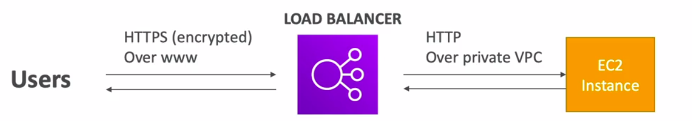

- Você pode gerenciar certificados usando o ACM (AWS Certificate Manager)
- Você pode fazer o upload do seu próprio certificado alternativamente
- O load balancer usa um X.509 certificado (SSL/TLS server certificate)

#### SNI - Server Name Indication

- SNI resolve um problema que é o carregamente de multiplos certificados SSL dentro de um servidor Web (para servir multiplos websites)
- É um "novo" protocolo, e requer que o cliente indique o hostname do servidor alvo no handshake inicial
- O servidor vai então procurar o certificado correto, ou retornar o padrão.

**SNI só funciona para ALB, NLB (nova geração) e CLoudFront**

 

Como funciona o SNI:
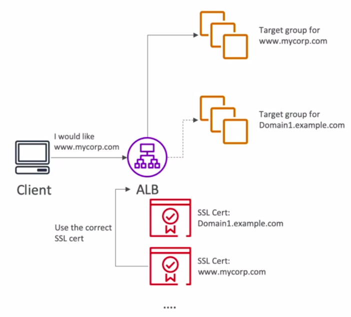

## Elastic Load Balancer - Deregistration Delay

É um tempo para completar as requisições que estão em andamento, enquanto a instância está sendo desregistrada ou está unhealthy

Como funciona:
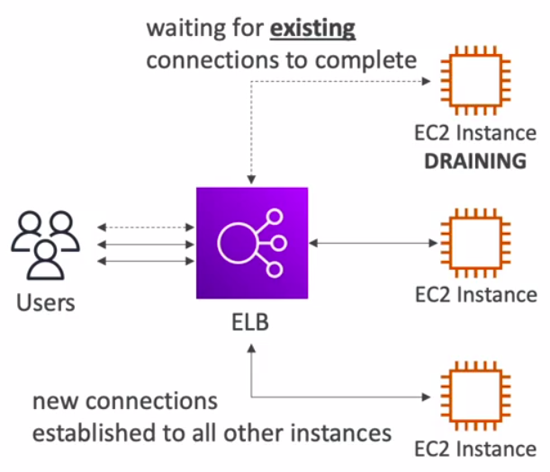

## Auto Scaling Groups (ASG)

**O que é?**
 
Basicamente é o esquema de redimensionar horizontalmente e automaticamente a quantidade de instâncias para aumentar ou diminuir a carga.

- Podemos adicionar instâncias
- Podemos diminuir instâncias
- Podemos assegurar uma quantidade minima e máxima de instâncias que ficarão rodando
- Ele consegue re-criar instâncias que foram terminadas, por exemplo se uma intâncias estava unhealthy
- ASG é grátis, só pagará pelos recursos usados abaixo dele, como por exemplo, instâncias EC2.

**Para que serve:** É usado para dimensionar automaticamente recursos com base na demanda, evitando sub ou
super provisionamento.   
**Caso de uso:** Escalonamento automático de instâncias EC2, dimensionamento automático de grupos de
instâncias, otimização de custos de recursos.   

**Quando devo usar o AWS Auto Scaling:** Você deve usar o AWS Auto Scaling para aplicativos que usam um ou mais recursos escaláveis e estão sujeitos a cargas variáveis. Um bom exemplo seria um aplicativo web de comércio eletrônico que recebe tráfego variável durante o dia. O aplicativo segue uma arquitetura padrão de três camadas: o Elastic Load Balancing distribui o tráfego recebido, o Amazon EC2 é a camada de computação e o DynamoDB é a camada de dados. Neste caso, o AWS Auto Scaling escalará um ou mais grupos do EC2 Auto Scaling e tabelas do DynamoDB usados pelo aplicativo para responder à curva de demanda.

**Link do serviço:** https://aws.amazon.com/pt/autoscaling/  
**Link do FAQ do serviço:** https://aws.amazon.com/pt/autoscaling/faqs/

**Como funciona o ASG:**
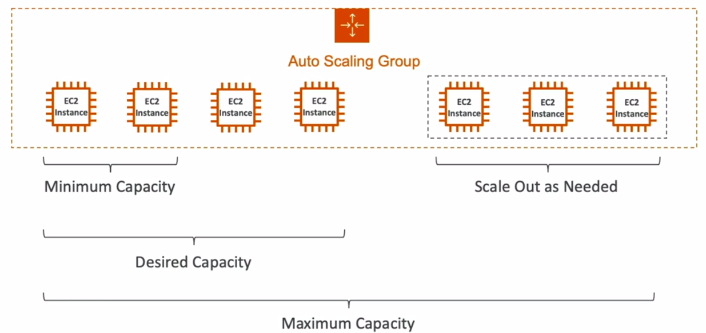

 

**Como funciona o ASG com ELB**
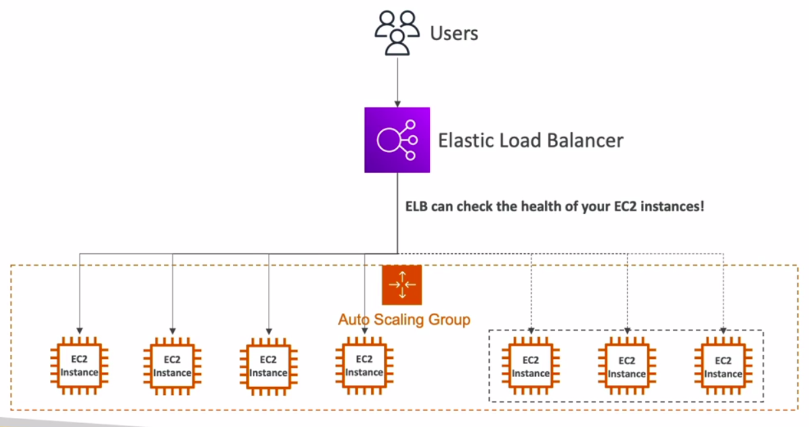

### Auto Scaling Group Attributes

Para o auto scaling group a gente precisa especificar alguns atributos que vão servir de base para quando novas instâncias forem lançadas.

Alguns desses atributos são:

- AMI + Tipo da instância
- EC2 User Data
- EBS Volumes
- Security Groups
- SSH Key Pair
- IAM Roles para as instâncias EC2
- Informações de Network + Subnets
- Informações de Load Balancer

Além disso o Auto Scaling Group também precisa de um tamanho minimo, um tamanho máximo, uma capacidade inicial e também politicas de dimensionamento.

### Auto Scaling - CloudWatch Alarms & Scaling

Podemos integrar o auto scaling group junto ao cloudwatch para que sempre que tiver algum alarme em algum métrica definida por nós o auto scaling atue tanto aumentando o número de instâncias quanto diminuindo o número de instâncias.

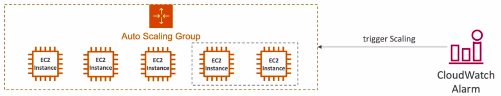

### Auto Scaling Groups - Dynamic Scaling Policies

**- Target Tracking Scaling**
  - Mais simples e fácil de configurar
  - Exemplo: Eu quero que a média de CPU no meu ASG fique por volta de 40%

**- Simple / Step Scaling**
  - Quando o cloudwatch é acionado (exemplo: CPU > 70%) então adiciona 2 instâncias

**- Scheduled Actions**
  - Antecipar o escalonamento baseado em padrões conhecidos de uso
  - Exemplo: Aumente a capacidade minima para 10 as 5 horas as Sextas feiras

### Auto Scaling Groups - Predictive Scaling

- Basicamente uma analise preditiva de escalonamento, a carga será analisada de acordo com o histórico passado

### Boas métricas para escalas

- Utilização de CPU
- RequestCountPerTarget
- Média de Network In / Out
- Qualquer métrica que você colocou no cloudwatch

### Auto Scaling Groups - Scaling Cooldowns

- Depois que uma atividade de escalonamento acontece, você fica em um periodo de cooldown padrão de 300 segundos.
- Durante esse periodo o ASG não vai lançar ou terminar instâncias para permitir que as métricas se estabilizem.

### Auto Scaling - Instance Refresh

O objetivo é que você queria atualizar um grupo inteiro graças a um novo template que você lançou e então re-criar todas instâncias EC2 novamente.

Basicamente definimos uma porcentagem minima de unhealthy para as instâncias e conforme elas vão sendo encerradas, novas instâncias vão se criando com o novo modelo que pedimos.

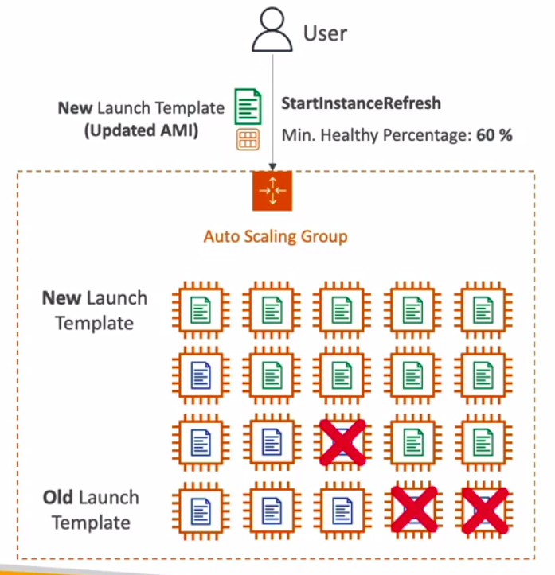

## Amazon RDS Overview

RDS significa Relation Database Service. É um serviço gerenciado de banco de dados para bancos de dados que usam SQL como uma linguagem de consulta.
 
Permite que você crie bancos de dados na nuvem que serão gerenciados pela AWS.

Os motores gerenciados pela AWS são:
- Postgres
- MySQL
- MariaDB
- Oracle
- Microsoft SQL Server
- Aurora (da própria AWS)

#### Vantagens de usar RDS vs Deployar seu próprio DB em um EC2

Pelo RDS ser um serviço gerenciado ele provê:

- Provisionamento automatico de OS
- Backup e Restore de um timestamp especifico (Point in Time Restore)
- Monitoração de dashboards
- Leitura de replicas para melhorar a performance de leitura
- Configuração de Multi AZ para Disaster Recovery
- Manutenção de atualizações de Windows
- Escalabilidade tanto vertical quanto horizontal
- Storage pelos EBS (gp2 ou ioL)

### RDS Storage Auto Scaling

É uma feature do RDS que ajuda a aumentar seu armazenamento do SB dinamicamente. Quando o RDS detecta que você está rodando sem espaço livre de armazenamento, ele escala automáticamente.
  
Isso evita que você escale manualmente os armazenamentos.
Você tem que configurar o **Maximum Storage Threshold** limite máximo para o armazenamento do DB.

Ele automaticamente modifica o armazenamento se:
- Espaço livre for menos que 10%
- Está em capacidade baixa pelos ultimos 5 minutos
- Se passou 6 horas desde a última modificação

Isso é muito bom para aplicações que tem carga de trabalho imprevisiveis.

Tem suporte para todas as engines de DB do RDS (MariaDB, MySQL, PostgreSQL, SQL Server, Oracle)

**Como funciona o auto scaling do RDS:**
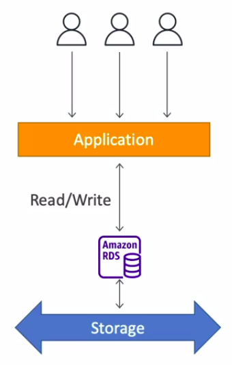

---

### RDS Read Replicas for read scalability

Basicamente, read replicas são mais instâncias que são criadas para ajudar na leitura da aplicação em acesso aos dados. Para que não se crie gargalo na instância do DB em relação a aplicação.

- Podemos ter até 15 replicas
- Elas podem atuar dentro de AZs, Cross AZs ou Cross Regiões
- A replicação acontece de forma assincrona
- As replicas podem ser promovidas para ser o próprio DB
- Replicas servem apenas para **leitura**

**Como funciona o RDS replicas:**

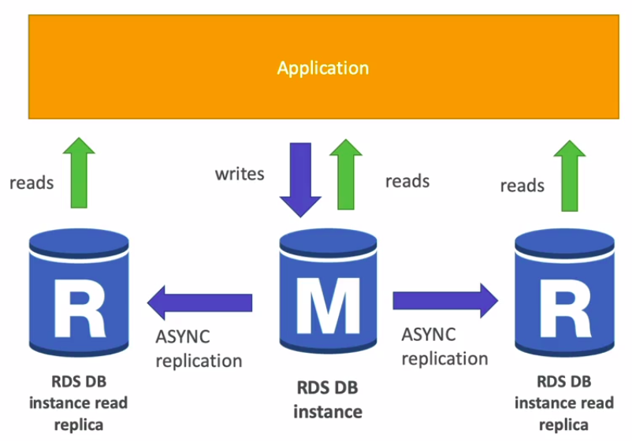

#### Exemplo de caso de uso para RDS Replicas

Você tem uma aplicação produtiva consumindo de uma instância RDS, a carga de trabalho é uma carga normal.
Você agora quer rodar uma outra aplicação de report de dados para ter alguns analiticos.
Então você cria uma nova Read Replica para rodar esse novo worload lá. A sua aplicação antiga não vai ser afetada por esse novo trafego.

**Diagrama de exemplo:**
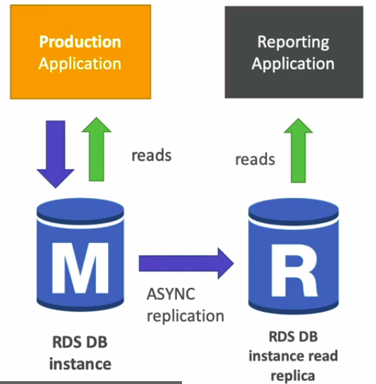

### Read Replicas - Custos

Normalmente a AWS cobra por dados que cruzam de um AZ para outro. Mas com serviços que são gerenciados isso não acontece. Para o RDS Read Replicas que estiverem dentro da mesma região, você não paga. 

Aqui está um diagrama de exemplo de custos, replicas em diferentes AZs, mas na mesma região o custo é grátis. Agora replicas que estão em diferentes regiões, tem um custo.

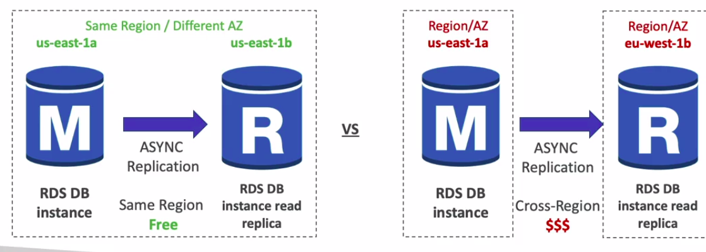

### RDS Multi AZ (Disaster Recovery)

- SYNC replicação
- Um DNS name
- Aumentamos a disponibilidade

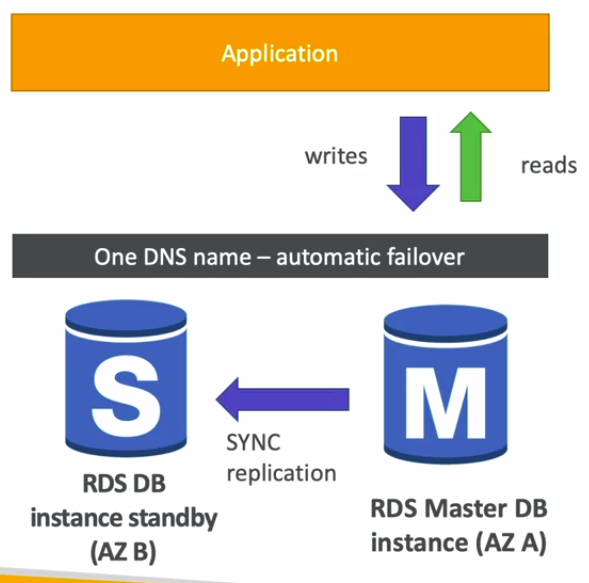

### Como passa de um Single-AZ para Multi-AZ RDS

- Aqui não precisamos ter tempo de parada no banco de dados
- Apenas com um click você modifica

Por trás dos panos o que acontece é o seguinte, é tirado um snapshot do db, e é restaurado no novo db em um novo AZ. A sincronização é estabelecidade entra os dois databases.

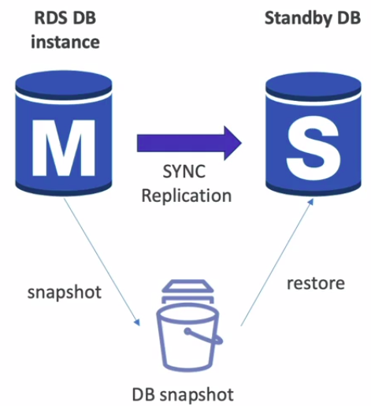

## Amazon Aurora

É um serviço de banco de dados relacional criado pela AWS.

- Não é open source 
- Postgres e MySQL são suportados como Aurora, significa que seus drivers vão funcionar no Aurora assim como funcioanavam no Postgre ou MySQL.
- Aurora é otimizado para a nuvem
- Ele cresce automaticamente conforme o storage precisa
- Aurora pode ter mais de 15 replicas 
- Failover no Aurora é instantaneo
- Ele tem um custo maior que o RDS, mas é mais eficiente.

### Aurora Alta disponibilidade e Read scaling

- Ele faz 6 cópias dos seus dados entre 3 AZs
- Ele faz um espécie de auto correção caso os dados estejam corrompidos

### RDS & Aurora Security

**Para criptografia em repouso:**
- Você poder ter seus dados criptografados, para isso no DB master e Replicas usa-se AWS KMS. Isso é definido logo no primeiro inicio de launch do banco de dados.
- Se o DB master não foi criptografado por algum motivo, as replicas também não poderão ser criptografadas.
- Se você tem um DB que não está criptografado e você quer criptografa-lo, o que você tem que fazer é criar uma snapshot e restaurá-la em outro DB criptografado.

**Para criptografia em trânsito**

- Os DB do Aurora já vem por padrão com essa criptografia em trânsito, para isso os clients devem utilizar os certificados root AWS TLS

**Sobre Autenticação**

- Tem o padrão de usuário e senha, mas também podemos usar IAM roles para conectar ao banco de dados

**Segurança**

- Podemos utilizar Security groups para controlar o acesso a rede do nosso banco de dados, por exemplo qual porta habilitamos ou qual IP.

**Não é disponivel utilizar SSH no Aurora ou RDS, exceto se for RDS custom**

**Audit logs podem ser habilitado e mandados para o CloudWatch para ter uma retenção desses logs por mais tempo**

## Amazon RDS Proxy

**TODO: pesquisar sobre**

## Amazon ElasticCache Overview

ElasticCache é para gerenciar Redis ou Memcached

Caches são banco de dados em memória com alto desempenho e baixa latência

Ele ajuda a reduzir as cargas ao banco de dados com altas cargas de leitura, ou seja, consultas comuns a ideia é que elas sejam armazenadas em cache para que todas as vezes tenha essa carga.

Ajuda também em tornar sua aplicação stateless, sendo assim tirando essa parte de estado da sua aplicação e levando para a AWS.

**Usar o ElasticCache envolve fazer grandes alterações de código**

**Exemplo de caso de uso com Elastic Cache:**
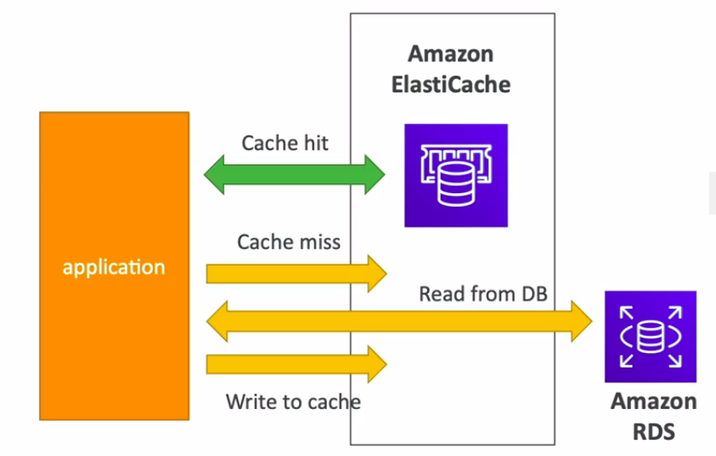

**Aqui um exemplo de uso guardando dados de sessão de usuário:**
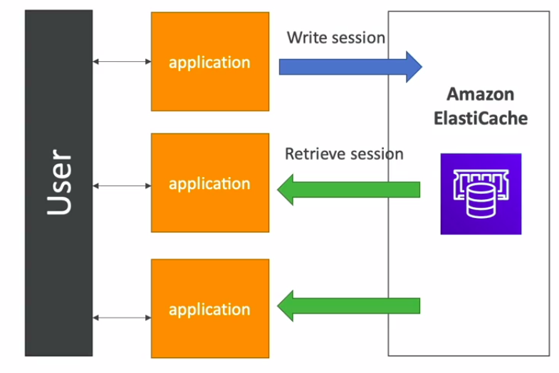

### ElasticCache Estratégias

- É seguro armazenar dados em cache? Em geral sim, mas pode acontecer do dado estar desatualizado, porntanto podem haver inconsistências. Portanto, não é para todo grupo de dados.
- Cache é efetivo: Depende, se seus dados tem poucas mudanças, poucas chaves sim é efetivo, por outro lado, se seus dados mudam com frequência e precisam de grande espaço não é efetivo.
- Estruturas como chave e valor e agregação são boas para o armazenamento em cache

### Lazy Loading / Cache-Aside / Lazy Population

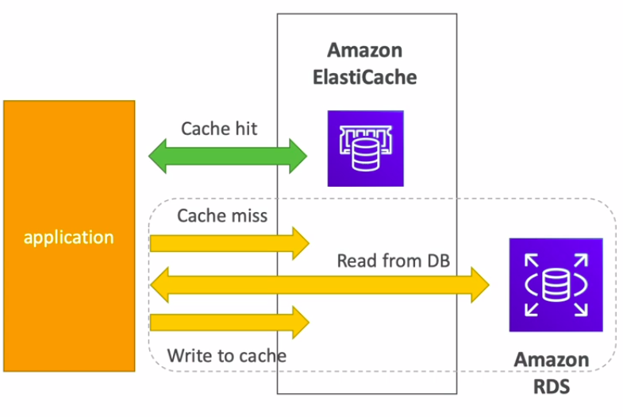

### Write Through

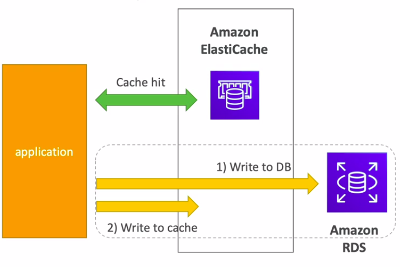

### Cache Evictions e Time-to-live (TTL)

Cache não é ilimitado. Então você pode explicitamente deletar um item

## DNS

DNS é basicamente uma tradução amigavel para os humanos do endereço de IP da máquina.

www.google.com => 172.217.18.36

O DNS é o backbone da internet.

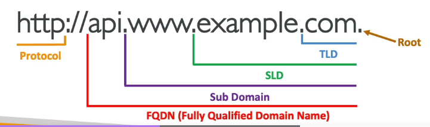

## Amazon Route 53

É um DNS de alta disponibilidade, escalonavel e totalmente gerenciado e autorizado com meios oficiais.

Route 53 também é um Domain Register.
E é o único serviço da AWS que provê 100% de disponibilidade.

### Route 53 - Record Types

**A** - É para mapear o nome do host em um IPv4
 
**AAAA** - É para mapear o nome do host em um IPv6
 
**CNAME** - É para mapear o nome do host para o nome de um outro host
 
**NS** - Esse é para servidores de nomes da zona de hospedagem. (Controla como o trafego é roteado para um domínio).

### Route 53 - Hosted Zones

É um container de registros que define como o trafego vai para um dominio e subdominios.

**Public Hosted Zones** - Contém registros que especifica como a rota trafega pela internet (public domain names).

**Private Hosted Zones** - Contém registros que especifica como você roteia o trafego entre uma ou mais VPCs (private domain names).

**Usar o Route 53 não é grátis, você paga por mês por hosted zone.**

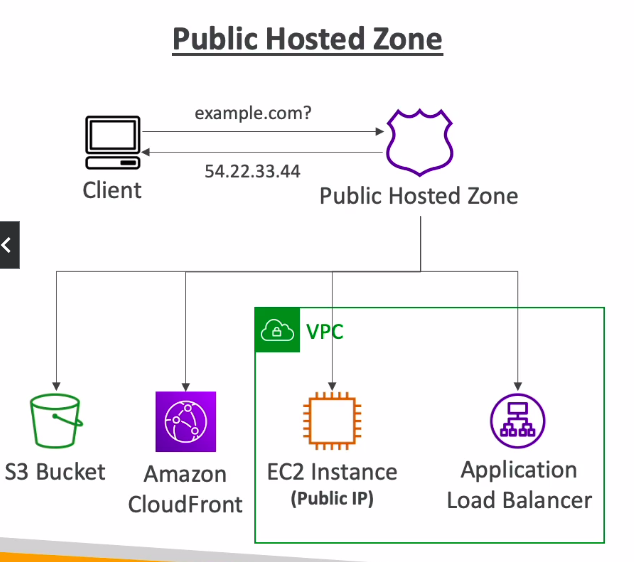

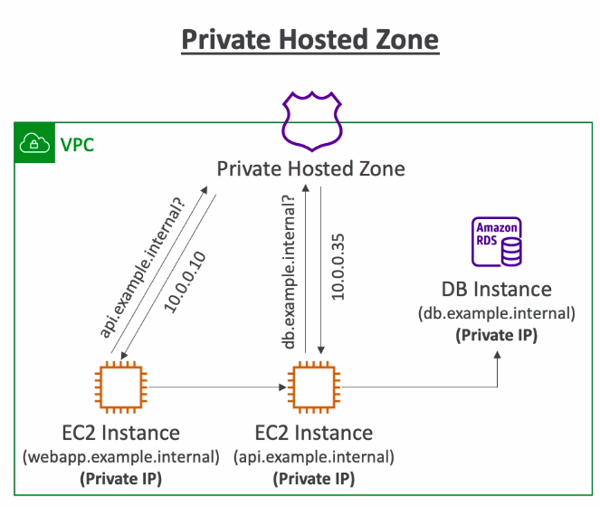

### Route 53 - Records TTL (Time To Live)

É uma especie de cache para que não se precise ficar chamando o DNS toda vez, assim a gente coloca um delay e consegue cachear esses dados.

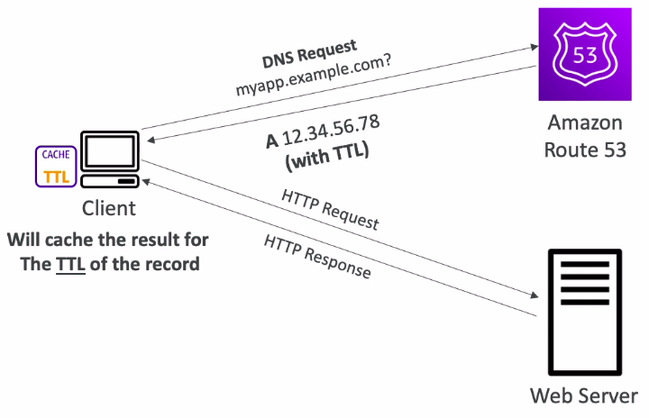

Alto TTL, 24 horas:
- Possibilidade do cliente buscar registros desatualizados
- Menos trafego no Route 53

Baixo TTL, 53 segundos:
- Vai gerar muito trafego no Route 53
- Registros ficarão desatualizados em menos tempo
- Facil para mudar registros no geral

**TTL é obrigatório para todos os registros, exceto o registro de Alias.**

### Routing Policies - Simple

Normalmente direciona o trafego para um único recurso. 
Um exemplo, o cliente vai querer ir para o endereço foo.example.com e o Amazon Route 53 vai responder direcionando para um registro A 11.22.33.44.

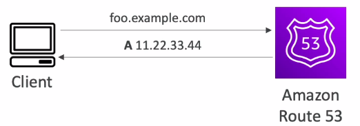

 
No caso dessa policie podemos especificar multiplos valores para o mesmo registro. Se multiplos valores forem retornados um randomico será escolhido para o cliente.

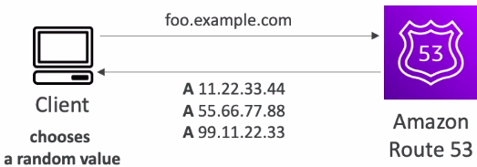

- Quando você ativa o Alias, você só pode especificar um recurso.
- Não pode ser associado com Health Checks

### Routing Policies - Weighted
A ideia aqui é que você pode ter uma porcentagem de solicitações que você pode controlar para ir para o seu recurso especifico.

Cada registro daremos um peso relativo:

Trafego (%) = Peso de um registro especifico / soma de todos os pesos de todos os registros

- Registros DNS devem ter o mesmo nome e tipo
- Podem ser associados com Health Checks
- Caso de uso: Load Balancing entre regiões, testando uma nova aplicação ou versão
- Você assinar o peso 0 (zero) a um registro faz para de mandar trafego para o recurso
- Se todos os registros tem o peso 0 (zero), então todos os registros vão ser retornados igualmente.

### Routing Policies - Latency-based

A ideia é que você queira redirecionar o recurso que terá a menor latência próximo a nós.
É muito útil quando a latência é sua principal preocupação para seus sites.

Latência será medida com base na rapidez com que os usuários se conectam à região de interesse mais próxima identificada para aquele registro. Por exemplo, usuário da Alemanha e a latência mais baixa for dos EUA.

Pode ser associado com Health Checks.

### Route 53 - Health Checks

HTTP Health Checks são apenas para serviços publicos.

Temos vários tipos de Health Checks, como por exemplo: 
- Health checks que monitoram um endpoint (application, server, ou algum outra serviço ou recurso da AWS)
- Health Checks que monitoram outros health checks (Calculated Health Checks)
- Health Checks que monitoram alarmes do CloudWatch 

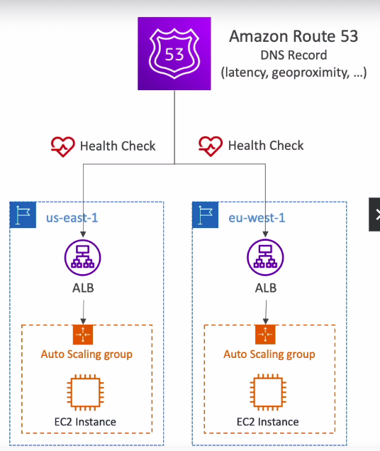

### Routing Policies - Geolocation

É diferente da Latency-based. Essa é baseada onde o usuários está realmente localizado.
Você pode direcionar o cliente de acordo de onde vem a localização dele.

### Geoproximity Routing Policy

Permite que você direcione o trafego de seus recursos com base na localização geográfica de seus usuários e recursos.

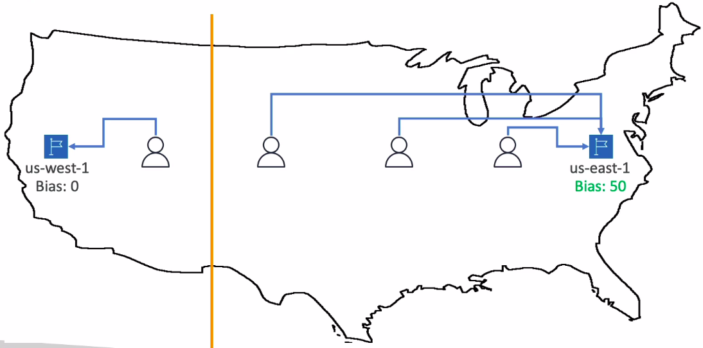

### Routing Policies - IP-based Routing

É baseado no endereço de IP do cliente.

### Routing Policies - Multi-Value

Usado quando quiser rotear o tráfego para vários recursos e a rota.

Route 53 retorna multiplos valores/recursos

Pode ser associado com Health Checks (Retorna apenas um valor para healthy resources)

## VPC Fundamentals

### VPC & Subnets Primer

- **VPC**: é uma numve privada que permite você faze deploy de recursos AWS nela.
- É um recurso Regional, ou seja, se tiver duas regiões você terá duas VPC's diferentes.
- Dentro das VPC's a gente tem as **Subnets**, que permitem particionar sua rede dentro da sua VPC. (Subnets e VPCs são definidas no nível de AZ)
- Uma subnet pública é acessivel pela internet.
- Uma subnet privada é aquela que não é acessivel pela internet
- Para definir o acesso à internet e entre subnets, usamos Route Tables.

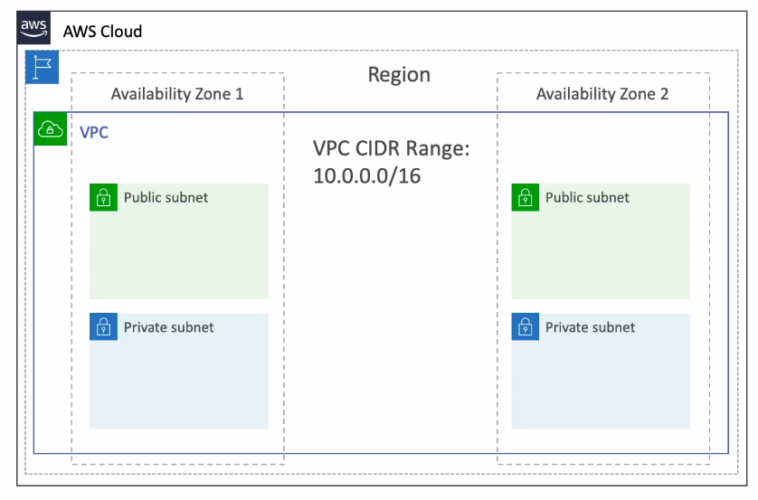

### Internet Gateway & NAT Gateways

Internet Gareways ajuda a nossa VPC a a se conectar com a internet

Subnets públicas tem a rota para o internet gateway. É isso que torna uma subnet pública ou privada, essa conexão com o internet gateway.

Já para subnets privadas usamos NAT Gateways (Gerenciado pela AWS) & NAT Instances (Auto gerenciado).

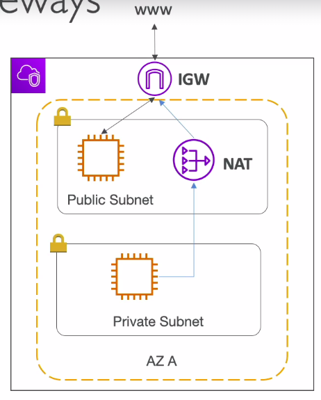

### Network ACL & Security Groups

- **NACL** (Network ACL)
  - É um firewall que controla o tráfego ee e para as subnets.
  - Pode ter regras de Allow e Deny de trafego
  - Você atacha os NACL's à Subnet 
  - As regras só incluem endereços de IP

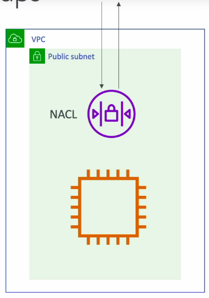

- **Security Groups** (Network ACL)

Security groups é um firewall que controla o trafego de e para uma interface de rede ENI / e EC2 Instance

- Pode ter somente ALLOW rules
- Rules incluem endereços de IP e outros security groups

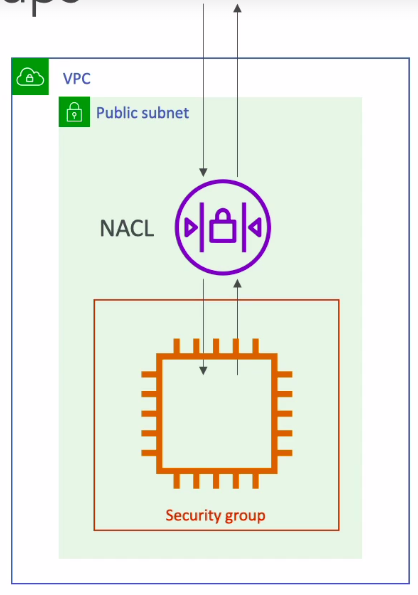

### VPC Peering

Esse usamos quando queremos conectar duas vpc's privadas

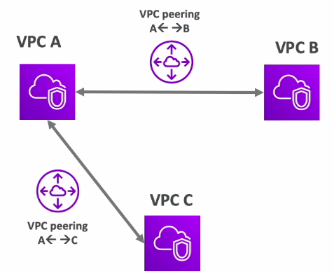

### VPC Endpoints

Permite que você se conecte aos seviços da AWS usando uma rede privada ao inves de uma rede www publica.

- Só é utilizado com VPC
- Da mais segurança e menor latencia para acessar serviços AWS

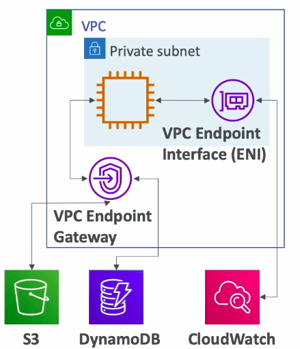

### Typical 3 tier solution architecture

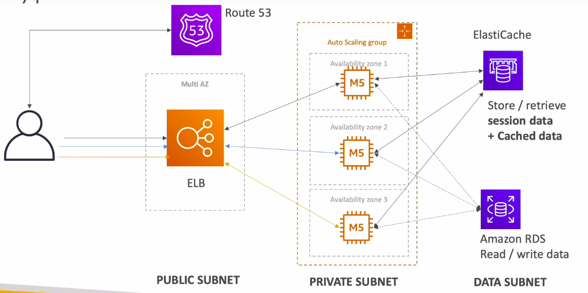

## Amazon S3

- Usado para armazenamento e backup
- Disaster Recovery
- Arquivamento
- Storage cloud hibrido
- Application hosting
- Media hosting
- Data lakes & Big Data analytics
- Software delivery
- Static website

 

- Amazon S3 permite armazenar objetos (arquivos) em "buckets" (diretórios)
- Buckets devem ter nome globalmente únicos (entre todas regiões e todas as contas)
- Buckets são definidos no nivel de região
- S3 parece ser um serviço global, mas buckets são criados no nivel de região
- Convenção de nomes
  - Sem letras maiúsculas, sem underline
  - 3 - 63 caracteres
  - Sem IP
  - Deve começar com letra minuscula ou numero
  - Não deve começar com prefixo xn--
  - Não deve terminar com sufixo -s3alias

### Amazon S3 Objects

Objects (arquivos) tem uma key. A Key é o caminho completo: s3://my-bucket/**my_file.txt**.

A key é composta pelo prefixo + nome do objeto.

### Amazon S3 Security

**User-Based** - IAM Policies, permissão para um usuário especifico ou grupo de usuários espeficos definidos no IAM

**Resource-Based** - Bucket Policies - permite aplicar regras diretamente ao bucket direto do console e também permite cross account.

**Objects Access Control List (ACL)**

**Bucket Access Control List (ACL)**

### S3 Storage Classes

#### Amazon S3 Standrd - General Purpose

- 99.99% Disponibilidade
- Usado para dados com frequencia de uso
- Baixa lantências e alta taxa de transferência
- Ele pode sustentar duas falhas de instalação simultâneas

#### Infrequent Access

- Para dados que são menos frequentemente acessados, mas querem rapido acesso quando precisa
- Custo é menor do que o S3 Standard

#### Glacier Storage Classes

- Armazenamento de baixo custo, destinado para arquivamento e backup
- Você paga pelo armazenamento + custo de recuperação dos arquivos

#### Intelligent-Tiering

- Permite mover objetos entre camadas ema excesso com base em padrões de uso

## AWS CLI, SDK, IAM Roles e Policies

### AWS EC2 Instance Metada (IMDS)

Permite que instâncias EC2 saibam uma sobre a outra sem usar IAM Role para isso.

A url é http://196.254.169.254/latest/meta-data

### AWS SDK Overview

Se quisermos executar ações diretamente no código dos nossos aplicativos sem abrir o CLI, usamos o SDK.

Detalhe é que se não especificarmos uma região a região padrão vai se us-east-1.

## Advanced Amazon S3
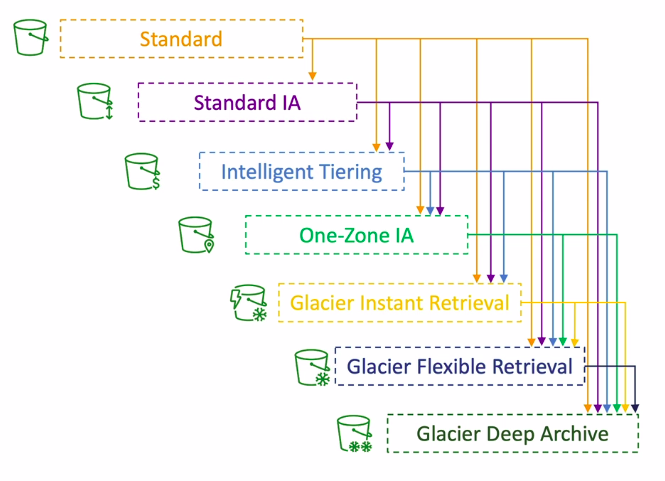

Cada uma dessas classes é definida de acordo com o tempo de armazenamento que você pretende deixar, portando se é objeto que você não acessa frequentemente mova para Standard IA. Para objetos que você não precisa de rápido acesso, mova-os para a camada Glacier ou Glacier Deep Archive... 

Essa movimentação pode ser feita manualmente, mas também podemos automatizar usando o Lifecycle Rules.

### Amazon S3 - Lifecycle Rules

**Transition Actions** - É a configuração de objeto para a transição de uma classe de armazenamento para outra. 

Por exemplo, criar uma ação que mova os objetos da classe Standard IA após 60 dias da criação. Ou que mova para a classe Glacier após 6 meses de criação.

**Expiration Actions** - É uma ação que permite configurarmos o tempo de expiração (deleção) de objetos após um certo tempo.

Por exemplo: Podemos criar regras para que logs de acesso sejam deletados após 365 dias. Ou podemos usar para deletar versões antigas de arquivos se o versionamento estiver ativo. Ou também podemos deletar aqueles arquivos que tiveram o upload incompleto.

Essas regras também podem ser criadas para prefixos especificos. Exemplo: s3://mybucket/mp3/*. Da mesma forma que também podemos criar regras especificas para determinadas tags.

### Amazon S3 Analytics - Storage Class Analysis

Nos ajuda a decidir quando transicionar objetos para a classe certa.

Ele faz recomendações para as classes Standar e Standard IA.

Dessa forma, o bucket s3 que tem a ele ligado o s3 analytics tem um csv com várias recomendações e informações. Os reports são feitos diariamente.
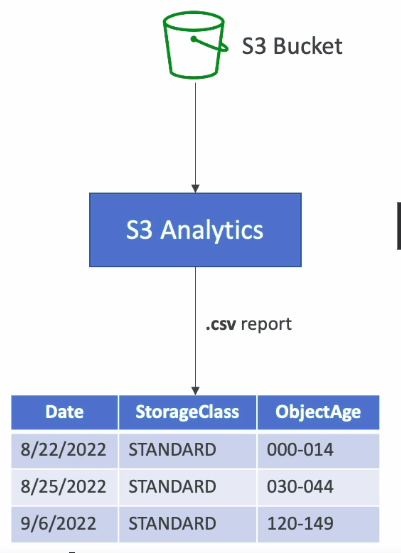

### Event Notifications

A ideia aqui é que o S3 pode criar notificações de determinadas ações que acontecem dentro dele. Por exemplo, quando um objeto é criado, quando um objeto é deletado, restaurado, replicado...

Então dentre esses eventos podemos filtrar por exemplo pelo tipo jpg.

Um caso de exemplo seria gerar thumbnails de imagens que subimos no s3 e se fosse o caso ativar uma lambda, ou mandar para um sns ou um sqs...

### Amazon S3 Security

#### Amazon S3 - Object Encryption

Nos buckets do S3 podemos criptografar os objetos com os 4 seguintes métodos.

- Server-Side Encryption (SSE)
  - Server-Side Encryption with Amazon S3-Managed Keys (SSE-S3) Habilitado por padrão. 
  - Server-Side Encryption with KMS Keys stoared in AWS KMS (SSE-KMS)
  - Server-Side Encryption with Customer-Provided Keys (SSE-C)
- Client-Side Encryption

#### Amazon S3 Encyption - SSE-S3
- Aqui é usada uma chave de criptografia que é manuseada, gerenciada e de propriedade da AWS. Você nunca tem acesso a essa chave.
- O objeto é criptografado do lado do servidor
- A criptografia é do tipo AES-256
- Você deve definir o header "x-amz-server-side-encryption":"AES256"
- Criptografia vem por padrão para novos buckets e novos objetos

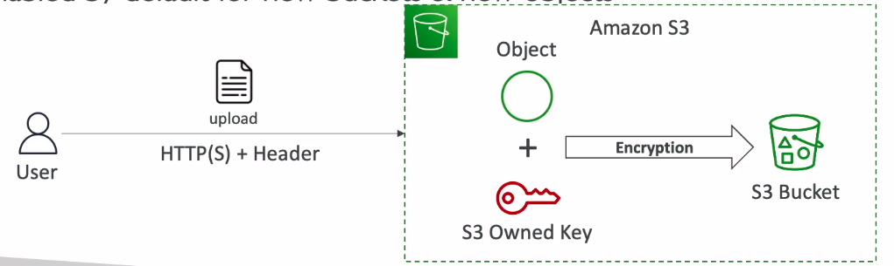

#### Amazon S3 Encryption - SSE-KMS
- Aqui você pode manusear e gerenciar a chave de criptografia através do serviço da AWS KMS (Key Management Service) 
- Usando o KMS você tem o controle das chaves e você também todos os registros de manusei das chaves no CloudTrail
- Objeto é criptografado do lado do servidor
- Para usá-lo precisa adicionar no header o seguinte: "x-amz-server-side-encryption":"aws:kms"

Uma limitação desse uso é que o agora para upload e download de objetos você vai precisar chamar a API do KMS e essas chamadas tem uma cota de limite de uso, essa cota pode ser aumentada através do console mas é bom ficar atento a esse ponto.

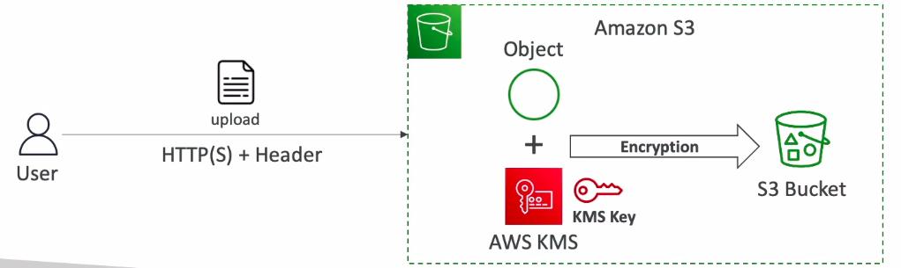

#### Amazon S3 Encryption - SSE-C
- Aqui as chaves usadas são totalmente gerenciadas pelo cliente, ou seja do lado de fora da AWS.
- Amazon S3 não guarda as chaves de criptografia, ela utiliza e depois descarta
- HTTPS deve ser utilizado
- A chave de criptografia deve ser provida no HTTP header, e em toda requisição HTTP que for feita

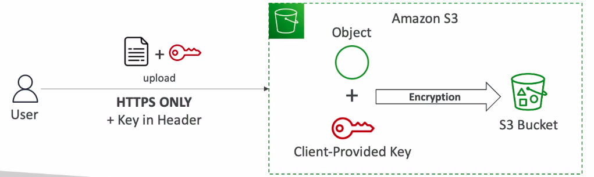

#### Amazon S3 Encryption - Client-Side Encryption
- Aqui o cliente é responsavel por criptografar usando uma biblioteca como Amazon S3 Client-Side Encryption Library
- O cliente deve criptografar os data ele mesmo antes de enviar para o Amazon S3
- Da mesma forma que o cliente é responsavel por descriptografar os dados depois de sair do Amazon S3
- Os clientes gerenciam totalmente as chaves e o ciclo de criptografia

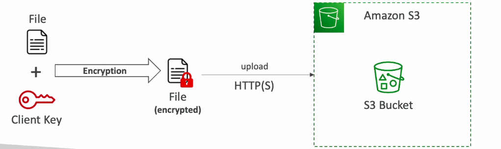

### CORS
Cross-Origin Resource Sharing (CORS). Cors seria uma chamada cruzada, a gente faz uma requisição a um dominio e esse dominio "responde" que partes do conteudo dele tem que buscar em outro dominio como uma imagem por exemplo, então ai entra a permissão de cors de fazer essa chamada cruzada ou não.

#### Amazon S3 - CORS
- Se o cliente faz uma chamada cruzada no seu bucket S3, nós precisamos habilitar o CORS correto ao header
- Você pode permitir para uma origin especifica ou para todas * (todas origens)

## AWS CloudFront

É uma rede de entrega de conteúdo ou CDN. Ele melhora a performance de leitura ao armazenar em cache o conteúdo de seu website em diferentes edge locations.

Melhora também a experiência dos usuários uma vez que a latência será menor.

CloudFront tem 216 pontos de presença global (edge locations).

Um outro ponto também com CloudFront é que sua aplicação estará seguro contra ataques DDOS, uma vez que o ataque visa focar em um ponto e fazer multiplas requisições por exemplo, com cloudfront sua aplicação é mundial.

### CloudFront Caching
- O cache fica nas pontas, ou seja nos Edge Locations
- O CloudFrton identifica cada objeto no cache usando o **Cache Key**

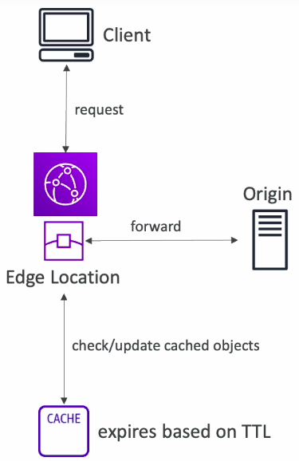

#### O que é o cloudfront cache key?
É basicamente um identificador único para cada objeto no cache. Por padrão ele consiste em **host + resource portion of the URL**

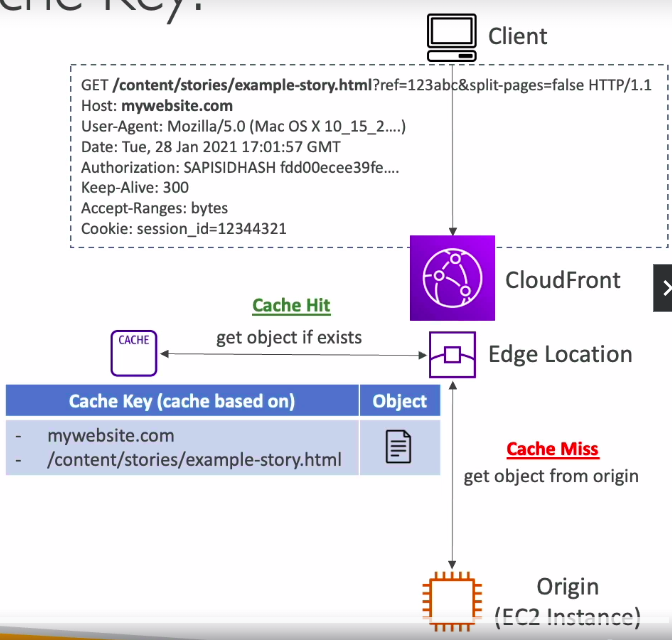

## Conteúdos adicionais de apoio para fixação 

[Mapa mental dos conteúdos da certificação](https://www.mindmeister.com/pt/2688053989/aws-developer).